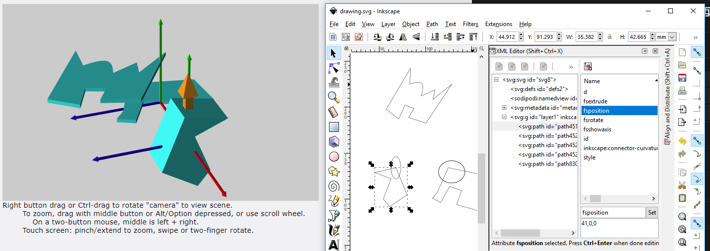
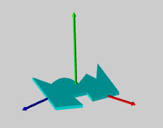

# FlatStack

Better documentation forthcoming.

FlatStack is a flatpack design system, intended to leverage the strength of existing vector software.

This project comes from frequently designing complex 3D assemblies to be laser cut. Using standard CAD packages like Fusion 360 or SolidWorks is annoying, because the sketch or drawing capabilities are not their primary purpose, and a little bit clunky as a result.

Proper vector software, like Inkscape or Illustrator, however, are fantastic.

This is an attempt at turning them into a CAD package of sorts, for flatpack designs.

Keeping the 3D view in one window off to the side, it will continuously update the 3D assembly as you draw the 2D profiles in your vector software of choice.

It is very much incomplete, and very much in development.

## SVG XML Commands

### fsjoint: id

All points of all paths within the area inside the path marked fsjoint will be labeled with that ID. Multiple paths can be marked with the same ID. All points with the same ID will be joined/mated/coincident with each other in the 3D assembly.

### fsextrude: depth

Depth in mm of the extrusion.

### fsrotate: degrees

Degrees of rotation, normal to vector path

### fsaxis: x, y, z

Vector of rotation, with respect to (1,0,0)

### fsposition: x, y, z

3D coordinates for the final 3D model

### fsshowaxis

true/false or 1/0 showing axis of rotation/translation. Default false. Arrows are RGB for XYZ axes.

### fsshowpoints

true/false or 1/0 showing vector points. Default false.

### fscolor / fscolour

Not yet implemented: Hex colour value of 3D object

### fsfixed

true/false for fixing object in place. Default false. Causes rotation and translation to be ignored. Undefined behaviour if two fixed object are mated.

## Understanding coordinates

### Positioning

In the x is red, positive numbers shift the object in direction that the arrow is pointing.
Y, height, is green.
Z is blue.

Position is calculated after rotation.

### Rotation

fsaxis default (0,0,0) is effectively (1,0,0).
So, entering a value of (0,0,1) would shift the X axis into the position of the Z axis, effective spinning the object in the same way a frisbee would spin.

## Installation

`git clone https://github.com/JarrettR/FlatStack.git`

`cd FlatStack`

`python -m pip install -r requirements.txt`

`python main.py`

If a DLL error occurs on Windows, install the x86 version of the [VC Redistributable](https://support.microsoft.com/en-us/help/2977003/the-latest-supported-visual-c-downloads)

